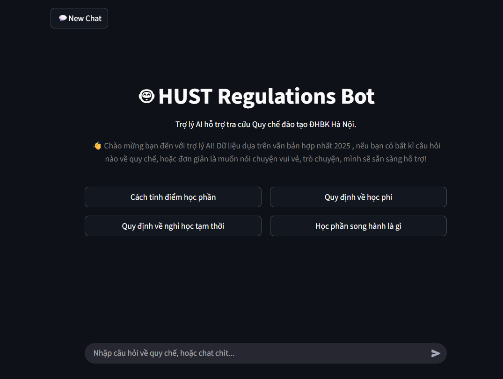

# 🤖 HUST Regulations Bot
<p align="center">
  [<a href="./docs/README-JP.md">🇯🇵 日本語</a>]
</p>

[](https://www.youtube.com/watch?v=2S-cWeajxHs)
## Overview
To easily query the school's academic regulations (*Quy chế đào tạo*) in natural language, this project aims to help students at **HUST (Hanoi University of Science and Technology)** by a **Retrieval-Augmented Generation (RAG) chatbot**.

The system uses a **Parent-Document-Retriever (PDR)** pattern with hybrid search (dense vector + BM25) and a router chain that automatically distinguishes between casual conversation and document-grounded Q&A.


## Prerequisites

| Requirement | Version / Notes |
|---|---|
| Python | `3.13+` (specific ver: `3.13.5`) |
| Groq API Key | Required - powers the LLM (`qwen/qwen3-32b`) |
| LangSmith API Key | Optional - for chain tracing |
| GPU (CUDA) | Optional - auto-detected (2GB VRAM minimum usage) ; CPU is the fallback for embeddings |

---

## Setup

### 1. Clone the repository
```bash
git clone https://github.com/mizuwonomu/rag-project.git
cd rag-project
```

### 2. Set up environment variables
Create a `.env` file in the project root:
```bash
GROQ_API_KEY=your_groq_api_key
LANGSMITH_API_KEY=your_langsmith_api_key   # Optional
```

### 3. Install dependencies
`uv` is preferred:
```bash
uv sync
# or with pip:
pip install -r requirements.txt
```

### 4. Build the vector store
* Create a `data_quyche/` folder inside project root.
* Place the source PDF [QCDT_2025_DHBK.pdf](https://ctt.hust.edu.vn/Upload/Nguy%E1%BB%85n%20Qu%E1%BB%91c%20%C4%90%E1%BA%A1t/files/DTDH_QDQC/Hoctap/QCDT_2025_5445_QD-DHBK.pdf) inside `data_quyche/`, then run:
```bash
python -m src.ingestion.ingest_regulations
```
This will:
- Split the PDF into *parent* chunks (one per "Điều" article)
- Create *child* chunks (`chunk_size=400`, `chunk_overlap=50`) and embed them into ChromaDB (`chroma_db/` folder)
- Persist parent docs as **pickled bytes** in `doc_store_pdr/` (This will be generated automatically)

### 5. Run the app
```bash
streamlit run frontend/app.py
```

---

## How It Works


```
User question
      │
      ▼
 Router chain ──► "chat"  ──► Friendly chat response 
                                  │
                                  ▼ 
                      Memory conversation + User Feedback
      │
      └──────► "RAG"
                  │
                  ▼
         EnsembleRetriever (child chunks only)
         ├── Dense: ChromaDB vector search  (weight 0.5)
         └── Sparse: BM25 keyword search    (weight 0.5)
                  │
                  ▼
         Top-k child doc_ids → fetch full parent docs from doc_store_pdr/
                  │
                  ▼
         QA chain (citation-enforced) → streaming answer + sources
                  │
                  ▼
        Store into memory conversation + User feedback about response
```
## Project Structure

```
rag-project/
├── frontend/
│   └── app.py                    # Streamlit frontend entry-point
├── src/
│   ├── __init__.py
│   ├── qa_chain.py               # Core RAG/chat chain logic
│   ├── utils.py                  # Shared utilities (embedding model loader)
│   └── ingestion/
│       ├── __init__.py
│       └── ingest_regulations.py # PDF ingestion & vector store population
├── data_quyche/                  # Raw PDF documents (not versioned)
├── chroma_db/                    # ChromaDB vector store (auto-generated, not versioned)
├── doc_store_pdr/                # Parent doc store (auto-generated, not versioned)
├── assets/                       # Static assets
├── docs/                         # Additional documentation
├── legacy/                       # Archived code — do not use
├── feedback_log.csv              # User feedback log (auto-created, not versioned)
├── .env                          # API keys — never commit
├── pyproject.toml                # Project metadata & pinned dependencies
├── requirements.txt              # pip install manifest
└── uv.lock                       # uv lockfile — do not hand-edit
```

---

## Key Design Decisions

| Component | Choice | Reason |
|---|---|---|
| Embedding model | `BAAI/bge-m3` (HuggingFace) | Strong multilingual (Vietnamese) performance |
| Vector store | ChromaDB | Persistent, local, no server needed |
| Parent store | `LocalFileStore` + pickle | Preserves full article context per "Điều" |
| Retrieval | EnsembleRetriever (dense + BM25) | Hybrid search balances semantic & keyword recall |
| LLM | `ChatGroq` - `qwen/qwen3-32b` | Fast inference via Groq API |
| Memory | In-process `ChatMessageHistory` | Lightweight single-session support |

---

## Notes

- `chroma_db/` and `doc_store_pdr/` are excluded from version control. Regenerate them with `python -m src.ingestion.ingest_regulations` after cloning.
- Never change the embedding model without re-running ingestion - the vector store and model must match.
- Keep `.env` file secure and never commit it.
