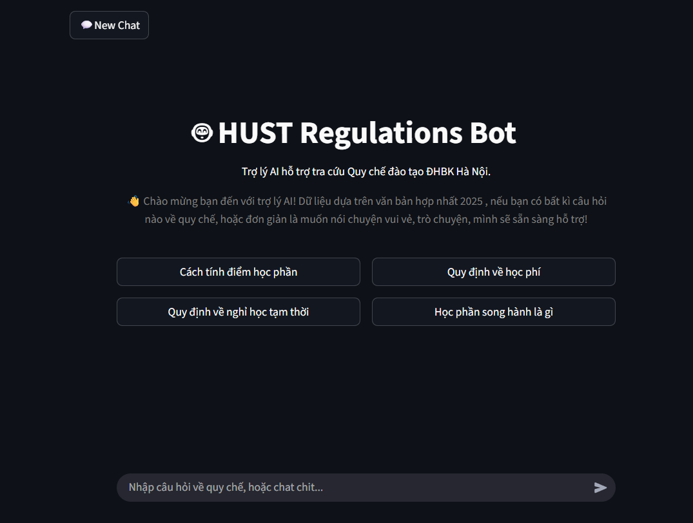
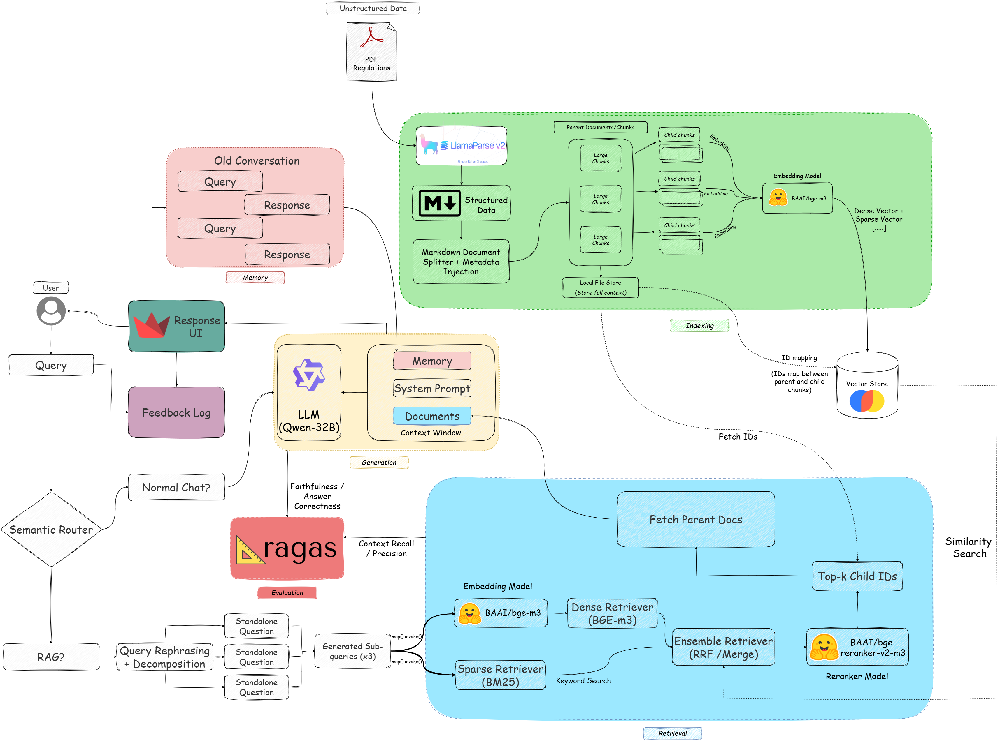

# 🤖 HUST 履修規定チャットボット 
<p align="center">
  [<a href="../README.md">🇺🇸 English</a>]
</p>

[](https://www.youtube.com/watch?v=WOms7keaQgc)

## 概要
本プロジェクトは、HUST(ハノイ工科大学)の学生が自然言語で履修規定について質問をできるよう、RAG(検索拡張生成)チャットボットを提供することを目的としています。

仕組みは **親ドキュメントリトリーバー (PDR)** パターンに **クエリの分解 (Query Decomposition)**、ハイブリッド検索 (密ベクトル + BM25)、および高精度検索のための **リランキング (Reranking)** を組み合わせています。なお、ルーターチェーンがユーザーの入力を雑談か文書に基づく回答かに自動判別し、処理を振り分けます。

---

## アーキテクチャの進化 (v1 から v2)

### V1の課題 (PDR + アンサンブル)
初期バージョンのRAGシステムは、標準的な親ドキュメントリトリーバー (PDR) とアンサンブル (密ベクトル + 疎ベクトル) 検索を組み合わせていました。機能はしていましたが、いくつかの重大な制限がありました：

- **高いトークン使用量:** 1リクエストあたりのトークン消費量は **2k - 4k トークン** でした。システムは関連性フィルターを持たない「ハードなトップk」ドキュメント抽出アプローチを使用していたため、頻繁に大きく関連性の低い親ドキュメントをLLMに渡し、コストとレイテンシを増大させていました。
- **ノイズの増加:** リランキング段階がないため、「ハードなトップk」検索では、キーワードは一致するものの特定の法的クエリには関連のない「ノイズドキュメント」が含まれることがよくありました。
- **マルチホップクエリでの誤検知:** V1は、異なるセクション間の論理的な接続を必要とするクエリに苦戦し、根本的な意図を理解せずにキーワードに気を取られることがよくありました。例えば、コーパスデータセットにおいて：
    - **ID 23:** 新入生が **専攻の変更** (*chuyển ngành*) の条件について質問した場合。V1は「GPA」や「学業条件」などのキーワードを共有しているという理由だけで、「ダブルディグリー」や「学業警告」に関する無関係なセクションを取得しました。
    - **ID 25:** 再履修単位を含む **エンジニアの卒業ランク** (*hạng tốt nghiệp kỹ sư*) に関するクエリ。V1は学位レベルを区別できず、「卒業ランク」というキーワードがあるため「修士号」の規定を取得し、エンジニア学位の特定のルールを見逃しました。
- **LLM-as-a-Judgeの試みの失敗:** LLMを使用して「偽の」または無関係なコンテキストをスコアリングしてフィルタリングする初期の試みは、高いレイテンシ、一貫性のないスコアリング、および専用モデルと比較して信頼できる確率のようなしきい値を提供できないため、失敗に終わりました。

### V2: 精度と効率 (クエリの分解 + PDR + アンサンブル + リランカー)
V2アーキテクチャは、精度とコンテキストの関連性を優先するように再設計されました：

- **マルチモデル構成による最適化**:
単一モデルによる処理から、タスクごとに最適化されたマルチモデル構成へ移行し、推論の精度と速度を両立させました。

  * **意図判別（Semantic Router）**： `llama-3.1-8b-instant` を採用し、低遅延で高精度な質問分類（雑談・RAG）を実現。

  * **クエリ変換・分解**： 推論能力の高い `llama-3.3-70b-versatile` を活用し、複雑な質問を複数のサブクエリに分解。

  * **最終推論（QA）**： `qwen/qwen3-32b` を推論エンジンとして使用し、根拠に基づいた正確な回答生成を担保。
- **クロスエンコーダーリランカー:** `BAAI/bge-reranker-v2-m3` モデルを統合し、元の質問に対する取得されたすべての子チャンクの関連性をスコアリングします。
- **ノイズキャンセリングとトークン最適化:** リランカースコアに **0.5 の関連性しきい値** を適用することで、リランカーモデルはLLMに到達する前に意味のギャップと誤検知を効果的に「キャンセル」します。これにより、トークン使用量が **50%削減** され、平均が **800 - 2k トークン** に下がり、回答の品質が向上しました。
- **複雑な表の保持:** LlamaParseを活用することで、V2は **Markdownテーブル** の複雑なフォーマットを保持します。これは、単位数の制限、成績換算式、卒業基準などの重要なデータが表形式で保存されることが多い大学の規定にとって不可欠です。

### 評価指標
V1からV2への移行では、再現率と精度の明確なトレードオフが見られ、V2はノイズを大幅に削減しています。

| 指標 | V1 (ベースライン) | V2 (最適化済み) | 影響 |
| :--- | :--- | :--- | :--- |
| **コンテキストの再現率 (Context Recall)** | 0.98 | 0.94 | より厳格なフィルタリングしきい値によりわずかに減少。 |
| **コンテキストの精度 (Context Precision)** | 0.84 | **0.9756** | **+13.5%** の向上。リランカーのノイズ除去能力を検証。 |
| **忠実度 (Faithfulness)** | 検索重視のベースライン | 0.7753 | 取得されたコンテキストに対する高い準拠度。 |
| **回答の正確性 (Answer Correctness)**| 検索重視のベースライン | 0.6315 | エンドツーエンドの応答精度に対する強固なベースライン。 |

## 仕組み
### V1: ベースラインアーキテクチャ


### V2: 高度なパイプライン [進化]


```
ユーザーの質問
      │
      ▼
 ルーターチェーン ──► "chat（雑談）" ──► 通常の会話応答
                                            │
                                            ▼
                              メモリ + ユーザーフィードバック
      │
      └──────► "RAG（検索拡張生成）"
                    │
                    ▼
         クエリの分解  [V2: 独立したサブクエリに分解]
                    │
                    ▼
         アンサンブルリトリーバー（密ベクトル + 疎ベクトル）
         ├── 密ベクトル検索：ChromaDB（重み 0.5）
         └── 疎ベクトル検索：BM25 キーワード検索（重み 0.5）
                    │
                    ▼
         クロスエンコーダーリランカー [V2: 意味のギャップを埋める＆ノイズのフィルタリング]
                    │
                    ▼
         上位 k 件の子チャンク doc_id → doc_store_pdr/ から親ドキュメントを取得
                    │
                    ▼
         QA チェーン（出典引用必須）→ ストリーミング回答 + 参照元
                    │
                    ▼
         会話履歴へ保存 + 回答に対するユーザーフィードバック
```

## 前提条件

| 要件 | バージョン / 備考 |
|---|---|
| Python | `3.13以上` (具体的なバージョン: `3.13.5`) |
| Groq API Key | 必須 - LLM(`qwen/qwen3-32b`)を駆動するために必要 |
| LlamaParse API Key| 必須 - 高精度のPDFドキュメント解析用 |
| LangSmith API Key | 任意 - チェーンのトレース用 |
| GPU (CUDA) | 任意 - 自動検出(最小 2GB VRAM 使用) ; GPUがない場合はCPUで埋め込み計算を行います|

---

## 設定

### 1. リポジトリのクローン
```bash
git clone https://github.com/mizuwonomu/rag-project.git
cd rag-project
```

### 2. 環境変数の設定
プロジェクトルートに `.env`ファイルを作成してください:
```bash
GROQ_API_KEY=your_groq_api_key
LLAMA_API_KEY=your_llama_api_key
LANGSMITH_API_KEY=your_langsmith_api_key   # 任意
```

### 3. 依存関係のインストール
`uv`の使用を推奨します:
```bash
uv sync
# または pip を使用する場合:
pip install -r requirements.txt
```

### 4. ベクトルストアを構築
* プロジェクトルートに `data_quyche/` フォルダを作成してください。
* `data_quyche/` に参照元のPDF [QCDT_2025_DHBK.pdf](https://ctt.hust.edu.vn/Upload/Nguy%E1%BB%85n%20Qu%E1%BB%91c%20%C4%90%E1%BA%A1t/files/DTDH_QDQC/Hoctap/QCDT_2025_5445_QD-DHBK.pdf) を置きます。
* パーサーを実行してPDFを構造化されたMarkdownに変換します:
```bash
python -m src.ingestion.parser
```
これにより、`data_quyche/` フォルダ内に構造化データのマークダウンファイルが作成されます。
* その後、取り込みスクリプトを実行してベクトルストアを構築します:
```bash
python -m src.ingestion.ingest_regulations
```
このスクリプトを実行することで、以下の処理が行われます:
- マークダウンファイルを明確な表やテキストブロックに分割します。
- 表の場合、リード文を含むメタデータを注入し、各表のヘッダーを保持します。
- テキストの場合、親のコンテキストを保持するために、各子チャンクに「Chuong（章）」-「Dieu（条）」のメタデータを注入します。
- *子チャンク* を作成し (`chunk_size=600`, `chunk_overlap=100`) 、ChromaDB (`chroma_db/` フォルダ)に埋め込みます。
- 親ドキュメントを **pickled 化されたバイトデータ** として保存（自動的に生成されます）

### 5. アプリケーションの実行
```bash
streamlit run frontend/app.py
```

---

## プロジェクト構成

```
rag-project/
├── evals/                        # 評価データセット、スクリプト、結果、指標
├── frontend/
│   └── app.py                    # Streamlit フロントエンドのエントリーポイント
├── src/
│   ├── __init__.py
│   ├── qa_chain.py               # RAG・会話チェーンのコアロジック
│   ├── reranker_utils.py         # 共通ユーティリティ（リランカーモデルのローダー）
│   ├── utils.py                  # 共通ユーティリティ（埋め込みモデルのローダー）
│   └── ingestion/
│       ├── __init__.py
│       ├── ingest_regulations.py # PDF 取り込み・ベクトルストア構築
│       ├── parser.py             # LlamaParse PDFパーサー
│       └── splitter.py           # メタデータ注入機能付きMarkdownスプリッター
├── data_quyche/                  # 参照元 PDF 文書（バージョン管理対象外）
├── chroma_db/                    # ChromaDB ベクトルストア（自動生成・バージョン管理対象外）
├── doc_store_pdr/                # 親ドキュメントストア（自動生成・バージョン管理対象外）
├── assets/                       # 静的アセット
├── docs/                         # 付加的なドキュメント
├── legacy/                       # アーカイブ済みコード - 使用不可
├── feedback_log.csv              # ユーザーフィードバックログ（自動生成・バージョン管理対象外）
├── .env                          # API キー - コミット禁止
├── pyproject.toml                # プロジェクトメタデータ・依存ライブラリの固定バージョン
├── requirements.txt              # pip インストール用マニフェスト
└── uv.lock                       # uv ロックファイル - 手動編集禁止
```

---

## 主要設計方針

| コンポーネント | 選択 | 理由 |
|---|---|---|
| 埋め込みモデル | `BAAI/bge-m3`（HuggingFace） | 多言語（ベトナム語）での高い性能 |
| ベクトルストア | ChromaDB | 永続化可能・ローカル動作・サーバー不要 |
| 親ドキュメントストア | `LocalFileStore` + pickle | 各「Điều（条）」単位で全文コンテキストを保持 |
| 検索方式 | EnsembleRetriever（密ベクトル + BM25）| 意味検索とキーワード検索のバランスを確保 |
| 検索方式 | `BAAI/bge-reranker-v2-m3` | クロスエンコーダー方式のリランカーを採用し、高精度な文書順位付け（Ranking）を実現 |
| LLM | `ChatGroq` - `qwen/qwen3-32b` | Groq API による高速推論 |
| 記憶管理 | インプロセス `RunnableWithMessageHistory` | 軽量なシングルセッション対応 |

---

## 注意事項

- `chroma_db/` および `doc_store_pdr/` はバージョン管理対象外です。クローン後は `python -m src.ingestion.ingest_regulations` を実行して再生成してください。
- 埋め込みモデルを変更する場合は、必ず取り込み処理（インジェスト）を再実行してください。ベクトルストアと埋め込みモデルは一致している必要があります。
- `.env` ファイルは厳重に管理し、リポジトリへのコミットは絶対に行わないでください。
